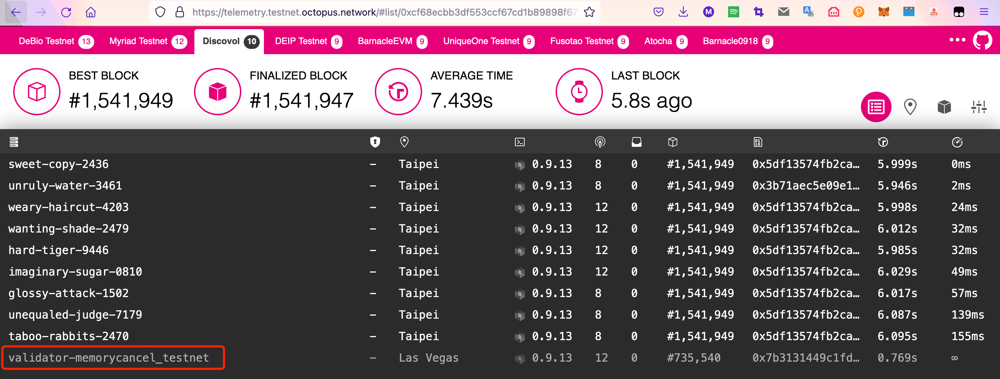

## 监控节点

Telemetry 会暴露节点的信息，你可以使用`--telemetry-url`选项连接到指定的 telemetry 服务器。如果你决定将节点信息发送到公共 telemetry，对于主网，当你启动验证人节点时，可以使用`--telemetry-url`选项，设置其值为`'wss://telemetry.mainnet.octopus.network/submit 9 '`，并且需要使用`--name`选项设置节点名称。这样访问 [telemetry](https://telemetry.mainnet.octopus.network/)，就可以通过你的节点名查看你节点的状态。

> 注意：
> * 对于测试网，使用`'wss://telemetry.mainnet.octopus.network/submit 9'`设置`--telemetry-url`选项，并访问 [telemetry](https://telemetry.testnet.octopus.network/) 查看节点状态。
> * 如果使用了自动部署，`--name`节点名称将默认为`validator-[near account]`, 其中`[near account]`为near钱包的账户名，如下图。

## 实例信息

如果使用了自动部署，可以在`My Node`面板，点击`···`，选择`Instance Info`可以查看当前实例的运行硬件状态信息（比如CPU、硬盘、内存），如下图：

